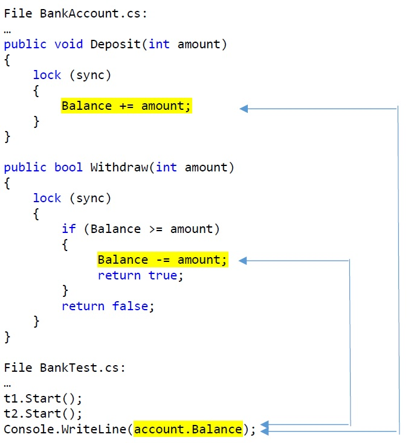

# BankTest Sample

## Issue Description (Data Races)

* `Main()` accesses `account.Balance` while two other threads `t1` and `t2` call `account.Deposit` and `Withdraw` concurrently.
* As only `Deposit` and `Withdraw` are synchronized and auto-property getter `account.Balance` is not, there occurs a data race between the read access in the property and the write accesses in `Deposit` and `Withdraw`

## Data Race 1

File `BankAccount.cs`:

    …
    public void Deposit(int amount)
    {
        lock (sync)
        { 
            Balance += amount; // WRITE ACCESS INVOLVED IN DATA RACE 1 
        }
    }

File `BankTest.cs`:

    …
    t1.Start();
    t2.Start(); 
    Console.WriteLine(account.Balance); // READ ACCESS INVOLVED IN DATA RACE 1

## Data Race 2

File `BankAccount.cs`:

    …
    public bool Withdraw(int amount)
    {
        lock (sync)
        {
            if (Balance >= amount)
            { 
                Balance -= amount; // WRITE ACCESS INVOLVED IN DATA RACE 2
                return true;
            }
            return false;
        }
    }

File `BankTest.cs`:

    …
    t1.Start();
    t2.Start(); 
    Console.WriteLine(account.Balance); // READ ACCESS INVOLVED IN DATA RACE 2

## Visualization

## Checker Output (2 Issues, 4 Locations)

    Issue: #0 Data race on BankTest.BankAccount.Balance
        caused by write at "Balance += amount" in BankAccount.cs line 11
            caused by call Deposit at "account.Deposit(100)" in BankTest.cs line 13
                caused by thread or task at "() => { account.Deposit(100); }" in BankTest.cs line 11
                    caused by call BankTest.BankTest.Main()
                        caused by initial thread at "Main" in BankTest.cs line 8
        caused by read at "account.Balance" in BankTest.cs line 22
            caused by call BankTest.BankTest.Main()
                caused by initial thread at "Main" in BankTest.cs line 8

    Issue: #1 Data race on BankTest.BankAccount.Balance
        caused by write at "Balance -= amount" in BankAccount.cs line 21
            caused by call Withdraw at "account.Withdraw(50)" in BankTest.cs line 17
                caused by thread or task at "() => { var result = account.Withdraw..." in BankTest.cs line 15
                    caused by call BankTest.BankTest.Main()
                        caused by initial thread at "Main" in BankTest.cs line 8
        caused by read at "account.Balance" in BankTest.cs line 22
            caused by call BankTest.BankTest.Main()
                caused by initial thread at "Main" in BankTest.cs line 8

## Problem Fixing (2 Options)

### Option 1: Thread Joins

In `BankTest.Main()`: Join the two threads before accessing `account.Balance`.

File `BankTest.cs`:

    t1.Start();
    t2.Start();
    t1.Join();  // JOIN FIRST THREAD 
    t2.Join();  // JOIN SECOND THREAD
    Console.WriteLine(account.Balance);

### Option 2: Monitor Lock

Use an explicit backup field for the `BankAccount.Balance` property and acquire a monitor lock in in getter. Use a full getter statement block. 

File `BankAccount.cs`:

    private int balance;

    public int Balance 
    { 
        get 
        { 
            lock (sync) // MONITOR LOCK AROUND READ ACCESS
            { 
                return balance; 
            } 
        }
    }
