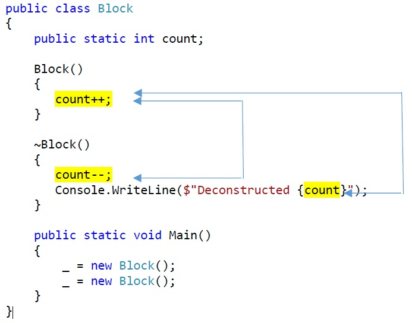

# Finalizer Sample

## Issue Description (Data Races)
* Two block instances are created in `Test()` method but not retained - only assigned to discard variables.
* (Discard variables in C# do not need to be allocated in memory but can be optimized away.)
* The two block instances hence become immediately garbage after creation.
* Their destructor (= finalizer) may run at any time after creation.
* The finalizer runs concurrently with subsequent construction.
* As both the finalizer and the constructor access the same variables involving writes, data races can occur.
* (Finalizer methods themselves run sequentially in the .NET runtime systems.)

File `Program.cs`:

    public class Block
    {
        public static int count;

        Block()
        { 
            count++; // ACCESS INVOLVED IN DATA RACE 1 and 2 
        }

        ~Block()
        { 
            count--; // ACCESS INVOLVED IN DATA RACE 1
            Console.WriteLine($"Deconstructed {count}"); // ACCESS INVOLVED IN DATA RACE 2 
        }

        public static void Main()
        {
            _ = new Block();
            _ = new Block();
        }
    }

## Visualization

## Checker Output (3 Issues, 6 Locations)

(4 combinations, as count++ and count-- are both a read and a write access, besides the read access of the console write-statement.)

    Issue: #0 Data race on Test.Block.count
        caused by write at "count--" in Program.cs line 16
            caused by finalizer at "Block" in Program.cs line 14
        caused by read at "count" in Program.cs line 11
            caused by call .ctor at "new Block()" in Program.cs line 23
                caused by call Test.Block.Main()
                    caused by initial thread at "Main" in Program.cs line 20

    Issue: #1 Data race on Test.Block.count
        caused by write at "count++" in Program.cs line 11
            caused by call .ctor at "new Block()" in Program.cs line 23
                caused by call Test.Block.Main()
                    caused by initial thread at "Main" in Program.cs line 20
        caused by write at "count--" in Program.cs line 16
            caused by finalizer at "Block" in Program.cs line 14

    Issue: #2 Data race on Test.Block.count
        caused by write at "count++" in Program.cs line 11
            caused by call .ctor at "new Block()" in Program.cs line 23
                caused by call Test.Block.Main()
                    caused by initial thread at "Main" in Program.cs line 20
        caused by read at "count" in Program.cs line 17
            caused by finalizer at "Block" in Program.cs line 14

    Issue: #3 Data race on Test.Block.count
        caused by write at "count++" in Program.cs line 11
            caused by call .ctor at "new Block()" in Program.cs line 23
                caused by call Test.Block.Main()
                    caused by initial thread at "Main" in Program.cs line 20
        caused by read at "count" in Program.cs line 16
            caused by finalizer at "Block" in Program.cs line 14

## Problem Fixing

Prevent garbage collection by keeping references to the created objects in local variables. 

File `Program.cs`:
    
    ...
    var b1 = new Block(); 
    var b2 = new Block();

It is also sufficient to only pin the first object, as then the second may be finalized but without any subsequent constructor calls. 

File `Program.cs`:
    
    ...
    var b1 = new Block();
    new Block();