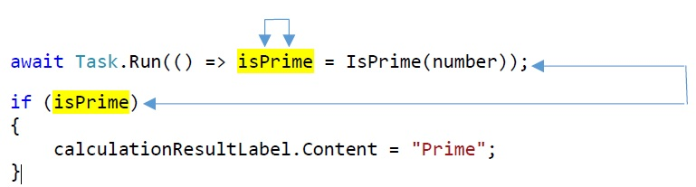

# Prime Checker UI Sample

## Issue Description (Data Races, async/await)
* A first UI click event occurs and starts the TPL task for the long computation.
* During the await, a second UI click event may occur and be dispatched.
* The second UI click event also starts a TPL task for the computation, writing `isPrime`.
* A data race can therefore happen between both tasks.
* Moreover, the first task may complete, such that the first await continues and `isPrime` is read in the subsequent if-condition. This can happen concurrently to the running task of the second UI call. This is also a possible data race.
* This happens in spite of the UI events and their await continuations being dispatched on the same thread.

### Data Race 1

File `MainWindow.xaml.cs`:

    ...
    await Task.Run(() => isPrime = IsPrime(number)); // WRITE ACCESS CAN HAPPEN CONCURRENTLY, PROVOKING A DATA RACE

### Data Race 1

File `MainWindow.xaml.cs`:

    ...
    await Task.Run(() => isPrime = IsPrime(number)); // WRITE ACCESS INVOLVED IN DATA RACE 
    if (isPrime) // READ ACCESS INVOLVED IN DATA RACE
    {
        calculationResultLabel.Content = "Prime";
    }

## Visualization

## Checker Output (2 Issues, 3 Locations)

    Issue: #0 Data race on TestAsyncUI.MainWindow.isPrime
        caused by write at "isPrime = IsPrime(number)" in MainWindow.xaml.cs line 21
            caused by thread or task at "() => isPrime = IsPrime(number)" in MainWindow.xaml.cs line 21
                caused by call TestAsyncUI.MainWindow.StartCalculationButtonClick(object, System.Windows.RoutedEventArgs)
                    caused by UI event at "StartCalculationButtonClick" in MainWindow.xaml.cs line 16
        caused by write at "isPrime = IsPrime(number)" in MainWindow.xaml.cs line 21
            caused by thread or task at "() => isPrime = IsPrime(number)" in MainWindow.xaml.cs line 21
                caused by call TestAsyncUI.MainWindow.StartCalculationButtonClick(object, System.Windows.RoutedEventArgs)
                    caused by initial thread at "StartCalculationButtonClick" in MainWindow.xaml.cs line 16

    Issue: #1 Data race on TestAsyncUI.MainWindow.isPrime
        caused by write at "isPrime = IsPrime(number)" in MainWindow.xaml.cs line 21
            caused by thread or task at "() => isPrime = IsPrime(number)" in MainWindow.xaml.cs line 21
                caused by call TestAsyncUI.MainWindow.StartCalculationButtonClick(object, System.Windows.RoutedEventArgs)
                    caused by UI event at "StartCalculationButtonClick" in MainWindow.xaml.cs line 16
        caused by read at "isPrime" in MainWindow.xaml.cs line 22
            caused by call TestAsyncUI.MainWindow.StartCalculationButtonClick(object, System.Windows.RoutedEventArgs)
                caused by initial thread at "StartCalculationButtonClick" in MainWindow.xaml.cs line 16

## Problem Fixing

Change the task launch to return the calculated value and assign it after the await: 

File `MainWindow.xaml.cs`:

    ...
    isPrime = await Task.Run(() => IsPrime(number)); // ASSIGN isPrime AS RESULT OF AWAIT

Alternatively, one can prevent further click event handling while another click event is still being processed. This can be achieved e.g. with a flag. 

File `MainWindow.xaml.cs`:

    ...
    private bool isRunning; // FLAG TO PREVENT CONCURRENT CALCULATIONS

    private async void StartCalculationButtonClick(object sender, RoutedEventArgs e)
    { 
        if (isRunning) // PREVENT CONCURRENT CALCULATIONS
        { 
            return; 
        } 
        isRunning = true;

        calculationResultLabel.Content = "(computing)";
        if (long.TryParse(numberTextBox.Text, out long number))
        {
            await Task.Run(() => isPrime = IsPrime(number));
            if (isPrime)
            {
                calculationResultLabel.Content = "Prime";
            }
            else
            {
                calculationResultLabel.Content = "No prime";
            }
        } 

        isRunning = false;
    }
